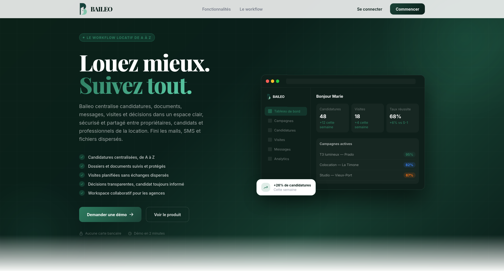
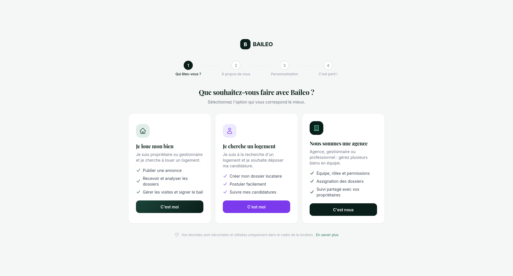
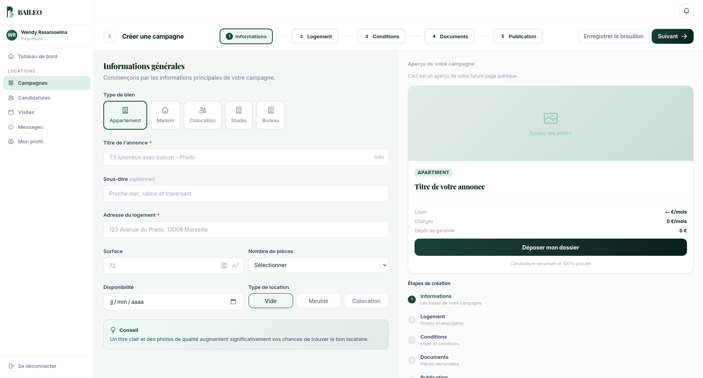
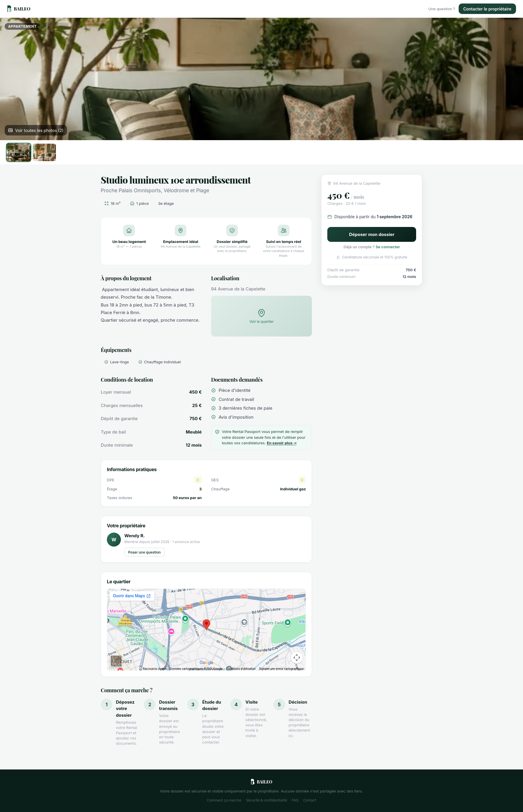
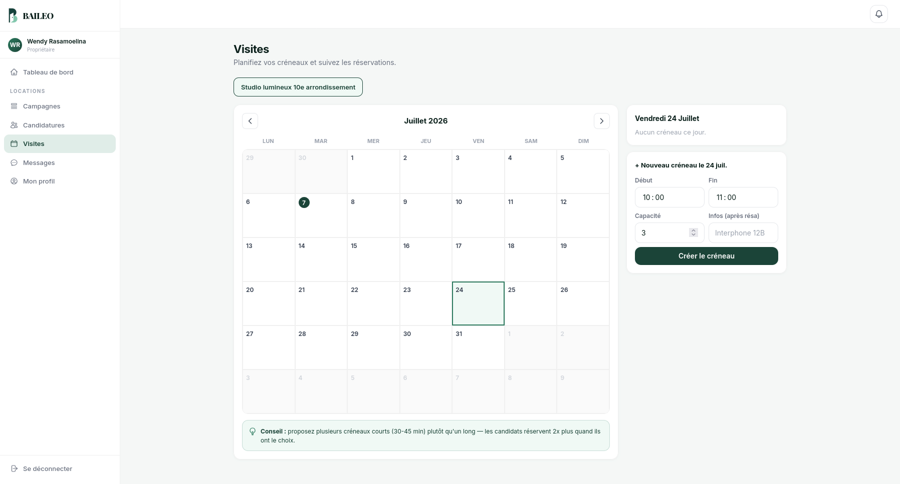
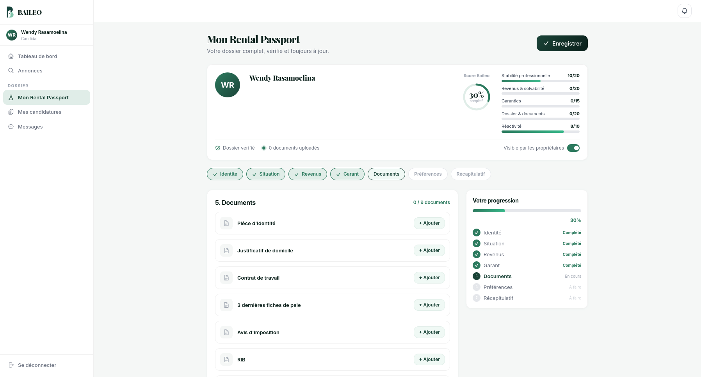
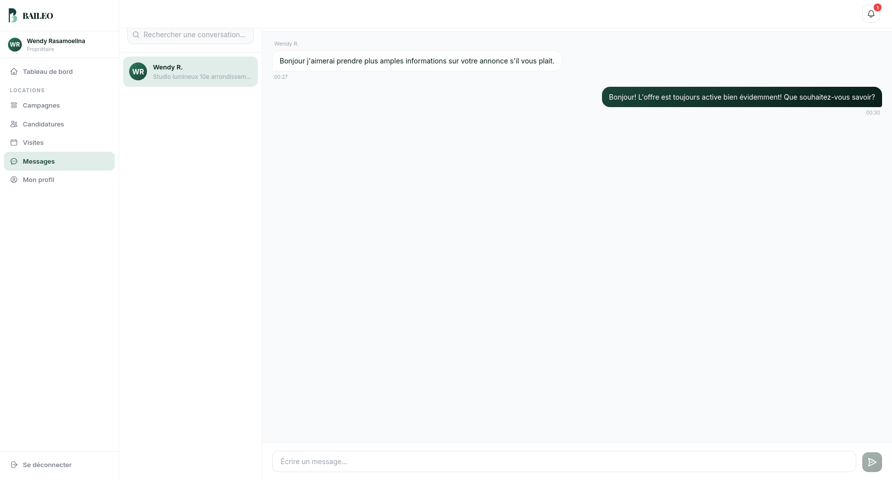
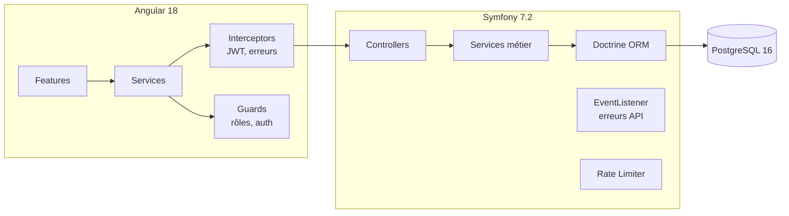
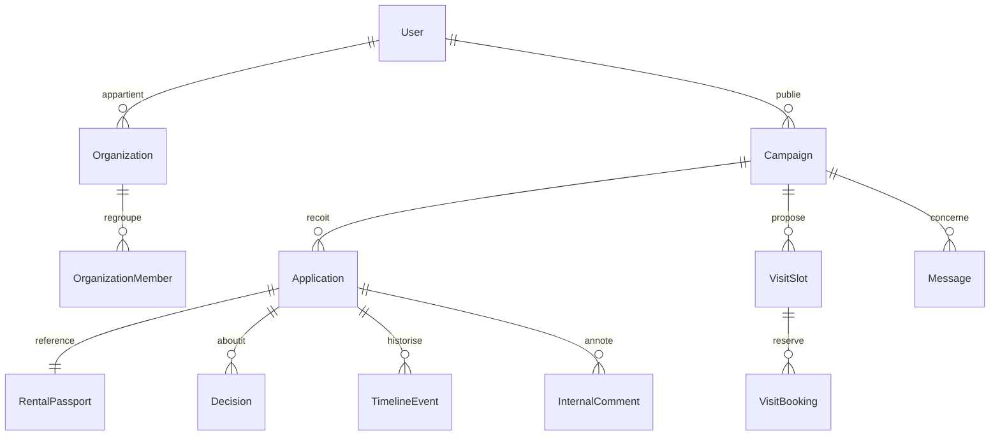

# Baileo

Plateforme de gestion locative qui centralise candidatures, documents, visites et décisions dans un espace partagé entre propriétaires, candidats et agences.


## Fonctionnalités

- **Campagnes de location** : création d'annonce en cinq étapes (informations, logement, conditions, documents, publication), page publique consultable sans compte.
- **Rental Passport** : dossier candidat unique et réutilisable (identité, situation, revenus, garant, documents), rempli une fois et partagé sur toutes les candidatures. Score de complétion par section.
- **Candidatures** : dépôt, suivi par statut, historique horodaté visible des deux côtés (propriétaire et candidat).
- **Visites** : créneaux avec capacité, réservation, rappel des bonnes pratiques de planification.
- **Messagerie** : conversation liée à une annonce, indépendante du dépôt d'une candidature.
- **Décisions** : acceptation ou refus avec notification, historisées dans la timeline du dossier.
- **Organisations** : mode agence avec plusieurs membres, rôles et permissions, dossiers assignés par agent.
- **Sécurité applicative** : limitation de débit par action (inscription, mot de passe oublié, candidature, message), verrouillage anti brute-force sur la connexion, format d'erreur API normalisé.

## Aperçu

<table>
<tr>
<td width="25%"></td>
<td width="25%"></td>
<td width="25%"></td>
<td width="25%"></td>
</tr>
<tr>
<td align="center"><sub>Landing page</sub></td>
<td align="center"><sub>Connexion</sub></td>
<td align="center"><sub>Choix du profil</sub></td>
<td align="center"><sub>Création de campagne</sub></td>
</tr>
<tr>
<td width="25%"></td>
<td width="25%"></td>
<td width="25%"></td>
<td width="25%"></td>
</tr>
<tr>
<td align="center"><sub>Annonce publique</sub></td>
<td align="center"><sub>Calendrier de visites</sub></td>
<td align="center"><sub>Rental Passport</sub></td>
<td align="center"><sub>Messagerie</sub></td>
</tr>
</table>

## Stack technique

| Couche | Techno |
|---|---|
| Frontend | Angular 18, standalone components |
| Backend | Symfony 7.2, API REST |
| Base de données | PostgreSQL 16, Doctrine ORM |
| Authentification | JWT (LexikJWTAuthenticationBundle) |
| Infrastructure | Docker Compose (nginx, PHP-FPM, PostgreSQL) |

## Architecture



Le frontend et le backend sont deux applications séparées communiquant en JSON sur `/api`, chacune avec son propre conteneur Docker.

### Modèle de données (simplifié)



22 entités Doctrine, 25 contrôleurs API organisés par domaine (campagnes, candidatures, visites, messagerie, organisation, passeport locatif, timeline).

## Sécurité

**Authentification.** JWT stateless, limitation à 5 tentatives de connexion par 15 minutes (par IP et par email combinés), hashage de mot de passe automatique (`password_hashers: auto`).

**Limitation de débit par action**, indépendante du login :

```yaml
framework:
  rate_limiter:
    register:        { policy: sliding_window, limit: 10, interval: '1 hour' }
    forgot_password:  { policy: sliding_window, limit: 5,  interval: '1 hour' }
    apply:            { policy: sliding_window, limit: 10, interval: '1 hour' }
    message:          { policy: sliding_window, limit: 60, interval: '1 hour' }
```

**Contrôle d'accès déclaratif** par chemin dans le firewall Symfony, avec routes publiques explicitement listées (santé de l'API, annonces publiques, lien de suivi candidat) et le reste fermé par défaut.

**Format d'erreur API normalisé.** Un event listener intercepte toute exception non gérée sur `/api` et la transforme systématiquement en `{ error: { code, message } }`, sans jamais exposer de stack trace ni renvoyer une page HTML à un client JSON.

**Traçabilité.** Entités dédiées `AuditLog` et `DocumentAccessLog` pour historiser les actions sensibles et les consultations de documents.

## Points d'implémentation

- **Rental Passport réutilisable** : un candidat remplit son dossier une fois (identité, situation, revenus, garant, documents), le complète par sections avec un score de progression, et le réutilise pour toutes ses candidatures sans ressaisie.
- **Lien de suivi sans compte** : `CampaignFollowLink` permet à un candidat de suivre l'avancement d'une candidature via un lien signé, sans création de compte ni mot de passe.
- **Onboarding différencié** : le premier écran oriente vers trois parcours distincts (propriétaire, candidat, agence), chacun avec ses propres champs et permissions en aval.
- **Timeline partagée** : chaque étape d'une candidature (dépôt, transmission, étude, visite, décision) est un `TimelineEvent` horodaté visible des deux parties, avec des niveaux de visibilité différents selon le rôle.
- **Contact sans candidature** : la messagerie liée à une annonce n'entraîne jamais la création automatique d'une candidature, les deux actions restent indépendantes.

## Difficultés rencontrées

| Problème | Cause | Résolution |
|---|---|---|
| `vendor/` écrasé au démarrage du conteneur | Le bind mount `./backend:/var/www/html` remplaçait le `vendor/` installé pendant le build Docker par le dossier local vide | Volume nommé dédié `vendor_data` monté par-dessus le bind mount |
| Organisations dupliquées à l'onboarding agence | Le flux ne distinguait pas "créer une agence" de "rejoindre une agence existante" | Séparation explicite des deux parcours dans `OrganizationController` |
| `POST /api/auth/login` renvoyait 404 | Le firewall Symfony interceptait la route avant qu'elle n'atteigne un contrôleur, sans `json_login` configuré | Configuration de `json_login` avec `check_path` dédié dans `security.yaml` |

## Installation

```bash
git clone https://github.com/wenskills/baileo.git
cd baileo
docker compose up -d --build
```

Le backend expose l'API sur `http://localhost:8000`. Renseigner les variables d'environnement backend (`backend/.env.local`, base de données, secret JWT) avant le premier démarrage.

```bash
cd backend
php bin/console doctrine:migrations:migrate
php bin/console lexik:jwt:generate-keypair

cd ../frontend
npm install
npm start
```

Le frontend Angular tourne par défaut sur `http://localhost:4200`.

## Structure

```
backend/
├── src/
│   ├── Controller/Api/   endpoints REST par domaine
│   ├── Entity/           22 entités Doctrine
│   ├── Service/          logique métier
│   └── EventListener/    normalisation des erreurs API
├── config/
│   └── packages/         security, rate_limiter, cors
└── migrations/

frontend/
└── src/app/
    ├── core/             guards, interceptors, services transverses
    ├── features/         un dossier par domaine (campagnes, candidatures,
    │                     visites, messages, passeport, agence, profil)
    └── shared/           composants réutilisables
```

## Roadmap

- Signature électronique du bail
- Recommandations de candidats par scoring (ATS-like)
- Notifications temps réel
- Tests d'intégration et CI
